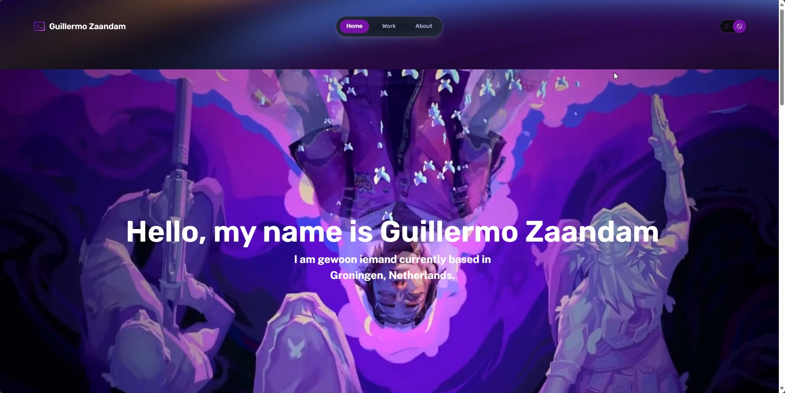
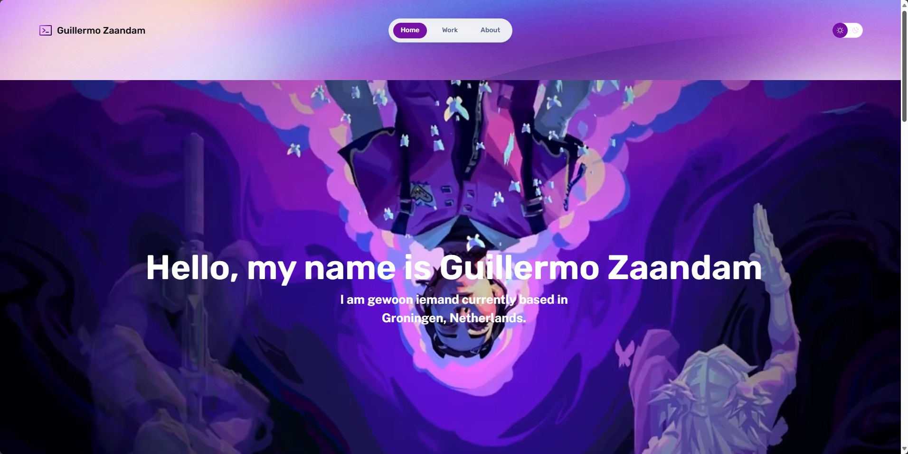

# Portfolio website Guillermo Zaandam

## Made with:

- Astro
- Template obviously (To speed things up)
- Tailwind

Portfolio blog came much later then I initally had in my mind.

---

# Already built-in

- Excellent SEO Built In
  Open Graph Tags (Twitter, Facebook, etc.)
  User Declared Canonical URLs
  RSS Feed
  XML Sitemap
  Robots.txt
  JSON LD Schema
  Markdown based blog posts with featured images
  Extremely minimal styles
  Performant Google Fonts Setup
  Remark (Table of contents)
  Astro-imagetools
  Shiki (syntax highlighter)

# What to do

- [x] Open Graph/Social cards (https://github.com/jonasmerlin/astro-seo) (https://docs.dummyapi.online/guides/astro-social-cards/) (https://github.com/shepherdjerred/astro-opengraph-images) (https://astro.build/integrations/)
- [x] About me
- [x] Home

Future ambitions

- [ ] The Verge style
- [ ] Ubuntu fonts or somethings else (https://www.launchfa.st/features/astro-font)
- [ ] Fuzzy search FuseJS (https://astro.build/integrations/?search=search) (https://www.fusejs.io/) example: https://github.com/satnaing/astro-paper
- [ ] Astro embed (https://astro-embed.netlify.app/)
- [ ] CMS Ready (https://tina.io/)
- [ ] Google translate (https://www.youtube.com/watch?v=iO6j3SR7U6Q) (https://github.com/yassinedoghri/astro-i18next)
- [ ] Google Analytics/Other analytics
- [ ] Text (https://cruip.com/creating-a-sliding-text-animation-with-tailwind-css/)

Source: https://github.com/treefarmstudio/astro-minimal-starter
